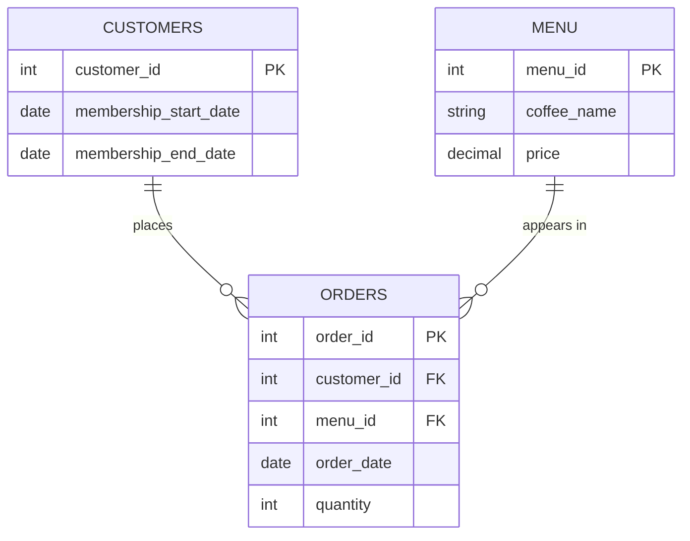

# ☕️ Ems Coffee - SQL Case Study

<p align="center">
  
  <br>
  <em>My favourite café where I did most of the work on this project.</em>
</p>

Ems Coffee is a small café with a membership program and a bunch of transaction data nobody's really dug into. This case study puts it to work: 3 tables (`orders`, `menu`, `customers`) and 12 SQL questions.

**[→ Click here for the Questions and SQL solutions](./questions-and-solutions.md)**

## 📊 Key Findings

- **✅ Membership pays off** - Members order 75% more often per person (8.54 vs. 4.88 orders/customer) and spend 45% more per order (RM25.50 vs. RM17.61) than non-members. Both positive effects. 
- **✅ Popular ≠ Profitable** - Matcha Latte outsells Mocha by volume (75 vs. 74 units), a small margin, but Mocha still takes the top revenue spot (12.73% vs. 12.04%) because of pricing.
- **✅ The business runs on regulars** - The 75% of customers classed as "regulars" generate 91.25% of all orders. One-time customers barely register at 0.75%.
- **✅ Lapsing has a real cost** - Every lapsed member ordered less often afterward with drop-offs ranging from ~29% to as much as ~89% depending on the customer.

## 📝 What's covered

- **Core (Q1-7)** — aggregate functions, joins, `CASE`-based segmentation, and an introduction to window functions
- **Advanced (Q8-12)** — CTEs, `DENSE_RANK()` with `PARTITION BY`, date-window reasoning relative to membership status, `NTILE()` for RFM customer segmentation, and `LAG()` for period-over-period trend analysis

## 📦 Schema



Full schema and data: [`schema/ems_coffee_schema.sql`](./schema/ems_coffee_schema.sql)

## Running it locally

1. Create a PostgreSQL database.
2. Run the schema file against it:

   ```
   psql -d your_database -f schema/ems_coffee_schema.sql
   ```

3. Connect and set the schema:
   ```
   psql -d your_database
   ```
   ```sql
   SET search_path TO ems_coffee;
   ```

4. Open [`questions-and-solutions.md`](./questions-and-solutions.md) and try each question yourself before checking the provided solution.

## ‼️ A Note on Approach

This case study was built with Claude for drafting and iteration because let's be real, writing everything from scratch is gonna be pretty tedious, **but** every query was run and verified against a live database and every result checked for logical correctness (not just "does it run?") before being included here. Where I found a data limitation or a genuine caveat worth flagging, it's noted directly in the questions rather than glossed over.

## 🙋🏻‍♀️ About me

Hi there! I'm Katie, an ACCA-qualified accountant with prior experience writing SQL questions, solutions, and tutorials as a consultant for DataLemur. After a few years away from the data field, this case study is my way of getting hands-on with SQL again.

Drop me a message here on Linkedin: [https://www.linkedin.com/in/katiehuangx/](https://www.linkedin.com/in/katiehuangx/)
