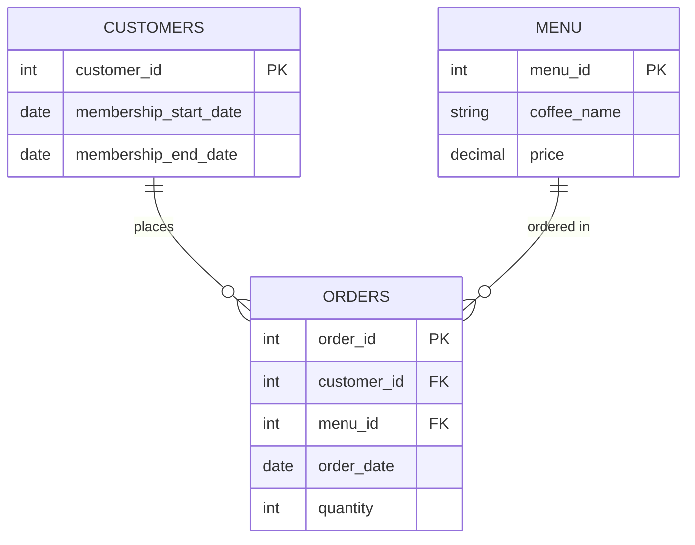

# ☕️ Ems Coffee — SQL Case Study


Ems Coffee is a small café with a membership program with a bunch of transaction data nobody's really dug into. This case study puts it to work: 3 tables (`orders`, `menu`, `customers`), 12 questions and one big underlying one — is the membership program actually worth running, or just something the café happens to offer?

**[→ Full questions, SQL solutions, and commentary](./questions-and-solutions.md)**

## 📝 What's covered

- **Core (Q1-7)** — aggregate functions, joins, `CASE`-based segmentation, and an introduction to window functions
- **Advanced (Q8-12)** — CTEs, `DENSE_RANK()` with `PARTITION BY`, date-window reasoning relative to membership status, `NTILE()` for RFM customer segmentation, and `LAG()` for period-over-period trend analysis

## 📦 Schema



Full schema and seed data: [`schema/ems_coffee_schema.sql`](./schema/ems_coffee_schema.sql)

## Running it locally

1. Create a PostgreSQL database.
2. Run the schema file against it:

   ```
   psql -d your_database -f schema/ems_coffee.sql
   ```

3. Open [`questions-and-solutions.md`](./questions-and-solutions.md) and try each question yourself before checking the provided solution.

## ‼️ A Note on Approach

This case study was built with Claude for drafting and iteration because let's be real, writing everything from scratch is gonna be pretty tedious, **but** every query was run and verified against a live database and every result checked for logical correctness (not just "does it run?") before being included here. Where I found a data limitation or a genuine caveat worth flagging, it's noted directly in the questions rather than glossed over.

## 🙋🏻‍♀️ About me

Hi there! I'm Katie, an ACCA-qualified accountant with prior experience writing SQL questions, solutions, and tutorials as a consultant for DataLemur. After a few years away from the data field, this case study is my way of getting hands-on with SQL again.

Drop me a message here on Linkedin: [https://www.linkedin.com/in/katiehuangx/](https://www.linkedin.com/in/katiehuangx/)