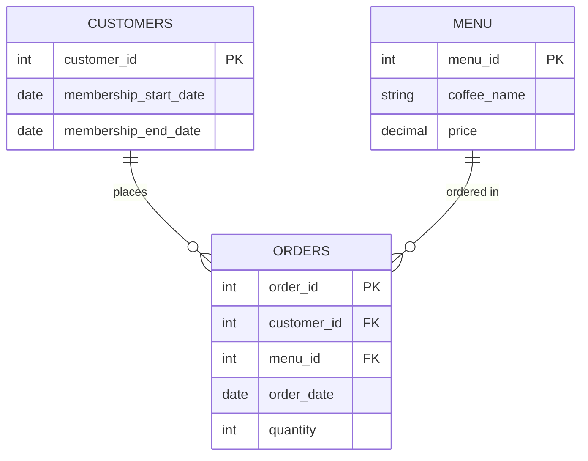

# ☕️ Ems Coffee — SQL Case Study

Ems Coffee SQL case study is built around a small café's customer membership program. Working from three tables — `orders`, `menu`, and `customers` - this project answers 12 business questions covering sales performance, customer behaviour, and whether the membership program is actually worth running.

**[→ Full questions, SQL solutions, and commentary](./ems-coffee-questions-final.md)**

## What's covered

- **Core (Q1-7)** — aggregate functions, joins, `CASE`-based segmentation, and an introduction to window functions
- **Advanced (Q8-12)** — CTEs, `DENSE_RANK()` with `PARTITION BY`, date-window reasoning relative to membership status, `NTILE()` for RFM customer segmentation, and `LAG()` for period-over-period trend analysis

## Schema



Full schema and seed data: [`schema/ems_coffee_schema_updated.sql`](./schema/ems_coffee_schema_updated.sql)

## Running it locally

1. Create a PostgreSQL database.
2. Run the schema file against it:
   ```
   psql -d your_database -f schema/ems_coffee_schema_updated.sql
   ```
3. Open [`ems-coffee-questions-final.md`](./ems-coffee-questions-final.md) and try each question yourself before checking the provided solution.

## About me

[A line or two about your background — ACCA chartered accountant, prior SQL consulting experience, returning to the data field]

[Your LinkedIn / contact link]