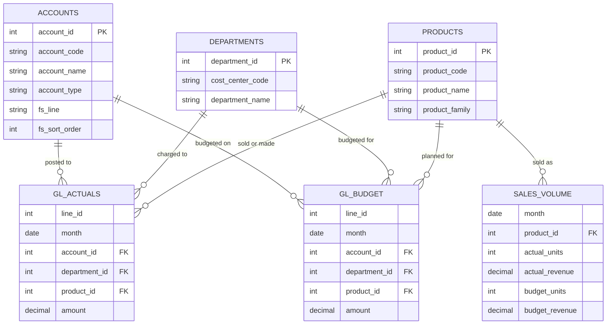

# Where did Q3 profit go?

**Penang Microworks Sdn Bhd** is a fictional Penang maker of electronic modules. Its Q3 2026 operating profit missed budget. This case study explains why, using SQL, an FS-format P&L and a short CFO memo.

## The company

- **Products:** 6 products in 3 families: sensor modules (high margin), power modules (low margin), connectivity boards (middle)
- **Cost centers:** Engineering, Operations, Sales & Marketing, G&A
- **Period:** FY2026 budget for Jan–Dec; actuals for Jan–Sep
- **Size:** about RM98m budgeted revenue, 15% operating margin

## Folder layout

```
data/      generated CSV files (the "ERP extract")
scripts/   generate_data.py, the data generator
sql/       table setup, load script, and one query file per question
```

## How to run it (Mac)

```
# 1. Create the data (only needed if you change the generator)
python3 scripts/generate_data.py

# 2. Create the database and tables, then load the CSVs
createdb penang_microworks
psql penang_microworks -f sql/00_create_tables.sql
psql penang_microworks -f sql/01_load_data.sql
```

Run these from inside this folder, since the load script uses relative paths.

## Tables

| Table | Grain | Notes |
| --- | --- | --- |
| accounts | One row per GL account | `fs_line` and `fs_sort_order` drive the P&L layout |
| departments | One row per cost center | |
| products | One row per product | |
| gl_actuals | One row per journal line | Jan–Sep; debits positive, credits negative |
| gl_budget | One row per budget line | Jan–Dec; same shape as gl_actuals |
| sales_volume | One row per product per month | Units and revenue for the PVM bridge; actuals NULL for Oct–Dec |

## Schema



## Data quality

The raw GL tables have no keys on purpose, like a real ERP extract. Run the data quality checks before any analysis.

*(Findings and treatment go here.)*

## Questions

1. What's the P&L in FS format: actual vs budget, with $ and % variances?
2. Which P&L lines drove the operating profit miss?
3. How much of the revenue variance came from price, volume and mix?
4. Which product families saw gross margin slip vs budget?
5. Which departments overspent on opex, and by how much?
6. What's the full-year forecast: actuals to date plus budget for the remaining months?
7. The CFO memo: the 3 main drivers explained in plain words

## Findings

*(CFO memo summary goes here.)*
