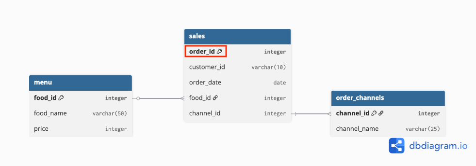

# 📝 Tutorial 

This tutorial is an introduction to SQL using a fun dataset inspired by a local Malaysian favourite: *Village Park Nasi Lemak 🍚🌶️🐔*. 

*(I'm Malaysian 🇲🇾 and I love Village Park's nasi lemak with crispy fried chicken 🍗 or what we call "ayam goreng" in Malay.)*

The tutorial questions are arranged in increasing difficulty ⬆️. We'll start with basics (**counting rows, selecting unique values and summing totals**) and gradually move into more advanced concepts (**joins, HAVING and CTEs**). 

Each question comes with a short explanation of the concept it teaches, so you can practice and build confidence step by step. 😉

If you’d like to:
- Check your answers → click the **▶️ Show solution 💡** toggle in each question to expand the solution. 
- Practice on your own or add into your portfolio → use the questions_only.md and insert your own solutions.

---

## 🌱 Beginner (Level 1–3)

### 1. How many total orders were made?

We’re simply counting all the rows in the `sales` table since each row represents one order. 

💡 **Key Takeaway:** Overall sales volume is one of the first metrics leadership looks at to measure store performance at a glance.

- **Step 1:** Identify the table where the data is from → `uptown_nasi_lemak.sales`. 
<p align="left">
  
</p>

*(Link to Entity Relationship (ER) diagram: [here](https://github.com/katiehuangx/Data-With-Katie/blob/main/uptown-nasi-lemak-sql-case-study/assets/erd.png))*

- **Step 2:** Use `COUNT(*)` or `COUNT(order_id)` to count the rows. 
- **Step 3:** Give the result a meaningful column name `AS sales_count`.

<details> 
<summary> ▶️ Show solution 💡 (click to expand) </summary>

```sql
SELECT COUNT(*) AS no_of_total_orders
FROM uptown_nasi_lemak.sales;
```

✅ Expected result: 36

</details>

### 2. What are the names of all menu items available?

Since duplicates don’t add value here, we use `DISTINCT` so each food name shows only once.  

💡 **Why it matters:** Clean, de-duplicated lists are critical when **sharing data with non-technical teams** like Marketing or Operation who expect to see **business-friendly labels** instead of IDs.

- **Step 1:** Identify table where menu items are stored → `uptown_nasi_lemak.menu`.  
- **Step 2:** Apply `DISTINCT` on `food_name` to remove duplicates.

<details> 
<summary> ▶▶️ Show solution 💡  </summary>

```sql
SELECT DISTINCT food_name
FROM uptown_nasi_lemak.menu;
```

✅ Expected result: 
| food_name              |
| ---------------------- |
| Nasi Lemak Ayam Goreng |
| Nasi Lemak Sotong      |
| Nasi Lemak Telur Mata  |

</details>


### 3. What is the total number of unique customers?

We’re finding how many different customers placed an order. That means counting distinct `customer_id`s rather than rows.

- **Step 1:** Identify table with customer IDs → `uptown_nasi_lemak.sales`.
- **Step 2:** Use `COUNT(DISTINCT customer_id)` to count unique values.

<details> 
<summary> ▶️ Show solution 💡</summary>

```sql
SELECT COUNT(DISTINCT customer_id) AS no_of_unique_customers
FROM uptown_nasi_lemak.sales;
```

✅ Expected result: 10
</details>

---

## 🛑 Intermediate (Level 4–6)

### 4. How many times was each dish ordered? Sort the results in ascending order by the count. 
We want to see the popularity of each menu item. 

📌 **Business Note:** It might feel easier to group by `food_id` and just output IDs, but in real-world reporting, IDs aren’t meaningful to business users. Showing the **actual dish names** makes the output presentation-ready, clearer, and more useful when sharing results with management.

- **Step 1:** Join the `uptown_nasi_lemak.sales` and `uptown_nasi_lemak.menu` to match orders with dish names.  
- **Step 2:** Use `COUNT(order_id)` grouped by `food_name` to find the number of times each dish was ordered.  
- **Step 3:** Sort the results in ascending order by the count.  

<details> 
<summary> ▶️ Show solution 💡</summary>

```sql
SELECT 
	menu.food_name,
  COUNT(sales.order_id) AS no_of_dish_ordered
FROM uptown_nasi_lemak.sales AS sales
INNER JOIN uptown_nasi_lemak.menu AS menu
	ON sales.food_id = menu.food_id
GROUP BY menu.food_name
ORDER BY no_of_dish_ordered ASC;
```

✅ Expected result:
| food_name | no_of_dish_ordered | 
| ---------------------- | --------------- | 
| Nasi Lemak Ayam Goreng | 11 | 
| Nasi Lemak Sotong | 12 | 
| Nasi Lemak Telur Mata | 13 |

</details>

### 5. What is the total revenue made by the restaurant?

📌 **Business Note:** Revenue tracking is the foundation of every financial report and is typically the first metric reviewed in monthly Profit & Loss.

- **Step 1:** Join `uptown_nasi_lemak.sales` with `uptown_nasi_lemak.menu` using `food_id` to get the price of each item sold.
- **Step 2:** Use `SUM(menu.price)` to add up the revenue from all rows.

<details> 
<summary> ▶️ Show solution 💡</summary>

```sql
SELECT SUM(menu.price) AS revenue
FROM uptown_nasi_lemak.sales AS sales
INNER JOIN uptown_nasi_lemak.menu AS menu
	ON sales.food_id = menu.food_id;
```

✅ Expected result:
| revenue |
| ------- |
| 416     |
</details>

### 6. What is the total number of orders from each order channel? Sort results by ascending order of the total number of orders.

We want to know how many orders came from Dine-In, Takeaway, and GrabFood. 

- **Step 1:** Join `uptown_nasi_lemak.sales` with `uptown_nasi_lemak.order_channels` using `channel_id`.
- **Step 2:** Count how many `order_id` values appear for each channel.
- **Step 3:** Group by `channel_name` and sort results.

📌 **Business Note:** Splitting by channel helps businesses evaluate the ROI of delivery partnerships and optimize staff allocation across delivery vs. dine-in vs. takeaway.

<details> 
<summary> ▶️ Show solution 💡</summary>

```sql
SELECT 
  channels.channel_name,
	COUNT(sales.order_id) AS no_of_orders
FROM uptown_nasi_lemak.sales AS sales
INNER JOIN uptown_nasi_lemak.order_channels AS channels
	ON sales.channel_id = channels.channel_id
GROUP BY channels.channel_name
ORDER BY no_of_orders ASC;
```

✅ Expected result:  
| channel_name | no_of_orders |
| ------------ | ------------ |
| GrabFood     | 10           |
| Takeaway     | 11           |
| Dine-In      | 15           |
</details>

---

## 🔥 Advanced (Level 7–10)

### 7. Which customer spent the most in total?

📈 **Corporate Insight:** This is useful in sales in identify the **highest revenue-generating customer**. Businesses can then analyse their spending behavior and design loyalty programs *(in this case, membership cards which they stamp and you get free Nasi Lemak! 🍚)*, targeted campaigns, or premium offers to maximize retention.

- **Step 1:** Join `uptown_nasi_lemak.sales` with `uptown_nasi_lemak.menu` to get the spending per order.
- **Step 2:** Group by `customer_id` to calculate total spending.
- **Step 3:** Order results by `total_spent` in descending order and select the **top** customer.

<details> 
<summary> ▶️ Show solution 💡</summary>

```sql
SELECT 
	sales.customer_id,
  SUM(menu.price) AS total_spent
FROM uptown_nasi_lemak.sales AS sales
INNER JOIN uptown_nasi_lemak.menu AS menu
	ON sales.food_id = menu.food_id
GROUP BY sales.customer_id
ORDER BY total_spent DESC
LIMIT 1;
```

✅ Expected result: 
| customer_id | total_spent |
| ----------- | ----------- |
| A           | 77          |
</details>

### 8. Which dish generated the most revenue?

📈 **Corporate Insight:** Knowing the top-earning dish helps restaurants decide what to feature on menus, run promotions for, or ensure that supply is never short.

- **Step 1:** Join `uptown_nasi_lemak.sales` with `uptown_nasi_lemak.menu`.
- **Step 2:** Group by `food_name`.
- **Step 3:** Order revenue in descending order (highest) and pick the top result.

<details> 
<summary> ▶️ Show solution 💡</summary>

```sql
SELECT 
	menu.food_name,
    SUM(menu.price) AS most_revenue_generated
FROM uptown_nasi_lemak.sales AS sales
INNER JOIN uptown_nasi_lemak.menu AS menu
	ON sales.food_id = menu.food_id
GROUP BY menu.food_name
ORDER BY most_revenue_generated DESC
LIMIT 1;
```

✅ Expected result: 
| food_name         | most_revenue_generated |
| ----------------- | ---------------------- |
| Nasi Lemak Sotong | 180                    |
</details>

### 9. What is the average order value for each channel? Round to the nearest 2 decimal points.

- **Step 1:** Join `uptown_nasi_lemak.sales`, `uptown_nasi_lemak.menu`, and `uptown_nasi_lemak.order_channels` to link orders with both prices and channels.
- **Step 2:** Use a `CTE` to calculate the total price per order by channel.
- **Step 3:** Apply `AVG` on order values and round to 2 decimals for readability.
- **Step 4:** Order results to easily see which channel has the highest AOV.

<details> 
<summary> ▶️ Show solution 💡</summary>

```sql
WITH order_channel_prices AS (
  SELECT 
    channels.channel_name,
    sales.order_id,
    menu.price
  FROM uptown_nasi_lemak.sales AS sales
  INNER JOIN uptown_nasi_lemak.menu AS menu
    ON sales.food_id = menu.food_id
  INNER JOIN uptown_nasi_lemak.order_channels AS channels
    ON sales.channel_id = channels.channel_id
)

SELECT
	channel_name,
  ROUND(AVG(price),2) AS avg_order_value
FROM order_channel_prices
GROUP BY channel_name
ORDER BY avg_order_value DESC;
```

✅ Expected result:
| channel_name | avg_order_value |
| ------------ | ---------------- |
| Dine-In      | 12.33            |
| Takeaway     | 11.73            |
| GrabFood     | 10.20            |
</details>

📈 **Corporate Insight:** Average order value (AOV) is a key business metric. It helps identify which sales channels (e.g., dine-in, takeaway, delivery) bring in higher-value customers. Companies can then prioritize or optimize the most profitable channels.

### 10. Which customer used all 3 order channels?

- **Step 1:** Select `customer_id` and `channel_id` from `uptown_nasi_lemak.sales`.
- **Step 2:** Use `COUNT(DISTINCT channel_id)` for each customer.
- **Step 3:** Filter results where the count = 3.

<details> 
<summary> ▶️ Show solution 💡</summary>

```sql
SELECT 
	customer_id,
  COUNT(DISTINCT channel_id) AS unique_order_channels
FROM uptown_nasi_lemak.sales
GROUP BY customer_id
HAVING COUNT(DISTINCT channel_id) = 3;
```

✅ Expected result:
| customer_id | unique_order_channels |
| ----------- | --------------------- |
| A           | 3                     |
| B           | 3                     |
| C           | 3                     |
| F           | 3                     |
| H           | 3                     |
</details>

---

Good job! You've completed the tutorials. Give yourself a pat on the back. 🎉

Now it’s time to put your skills to the test with the Assignment!
